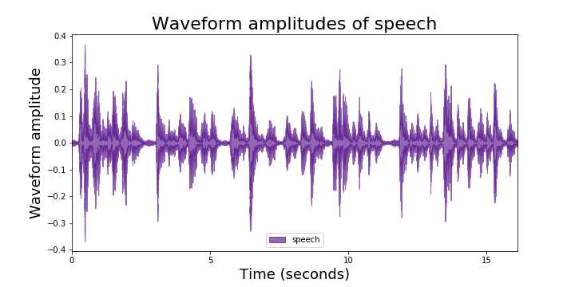
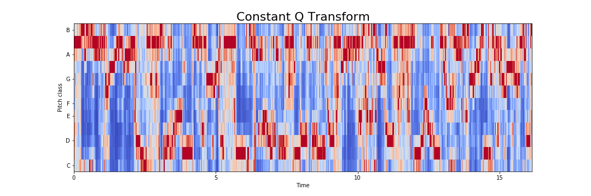

# Speaker recognition using Machine Learning and PySpark 

## Project Description

This project aims at recognising speakers based on their audio files.
- Binary classification for gender of speaker:

	Based on reported, binary gender with F1 score of `0.89`
- Multi-class classification with 47 speakers:

	Be able to recognise the speakers with mean class per error of `0.196`

See our jupyter notebook for data preprocessing using Python and exploratory data analysis done using PySpark.

## Data Preprocessing

### Constant-Q Transform

## Background information

An assumption that is made before speech recognition is that the audio quality is adaquate enough for the model to pick up who is talking. However, we know that when people are using voice activated features, they are not always in a quiet room and certain sounds could be picked up more than the speakers themselves. 

For the Interspeech 2019 VOiCES Challenge dataset, various different speakers are reading a script in isolation. Then their sound clips are synthetically blended with 3 other environment sounds, generating 4 total settings (original clip without blending, background babbling, music playing, and ambient TV sounds).

Project contributors include: [Nishat Khan](https://www.linkedin.com/in/nishat-parveen), [Zijun (Annette) Lin](https://www.linkedin.com/in/zijun-annette-lin), [Ming-Chuan Tsai](https://www.linkedin.com/in/kirsten-tsai-869724156), [Kathy Yi](https://www.linkedin.com/in/kathleen-yi)

Data source: https://app.box.com/s/9tpuuycgxk9hykr6romsv05vvmdpie11/folder/63601325793
